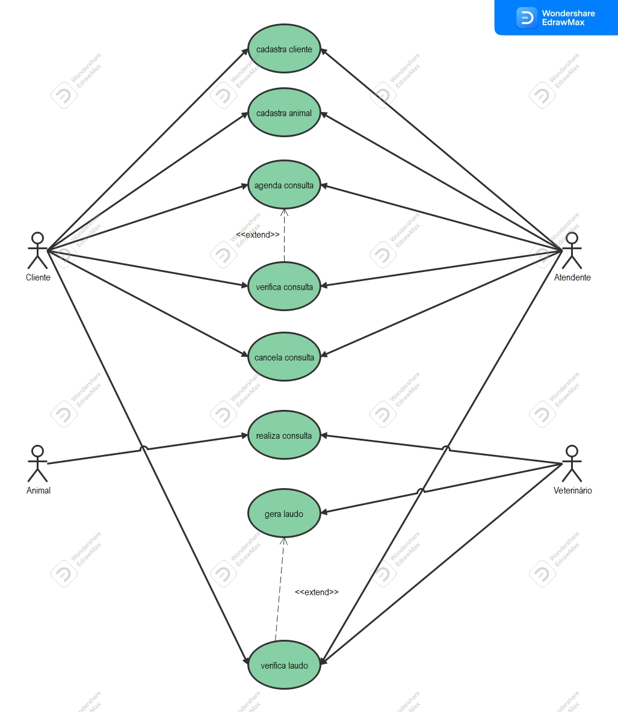
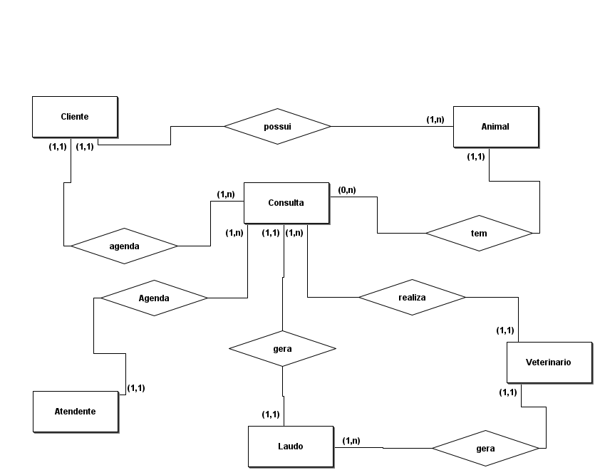
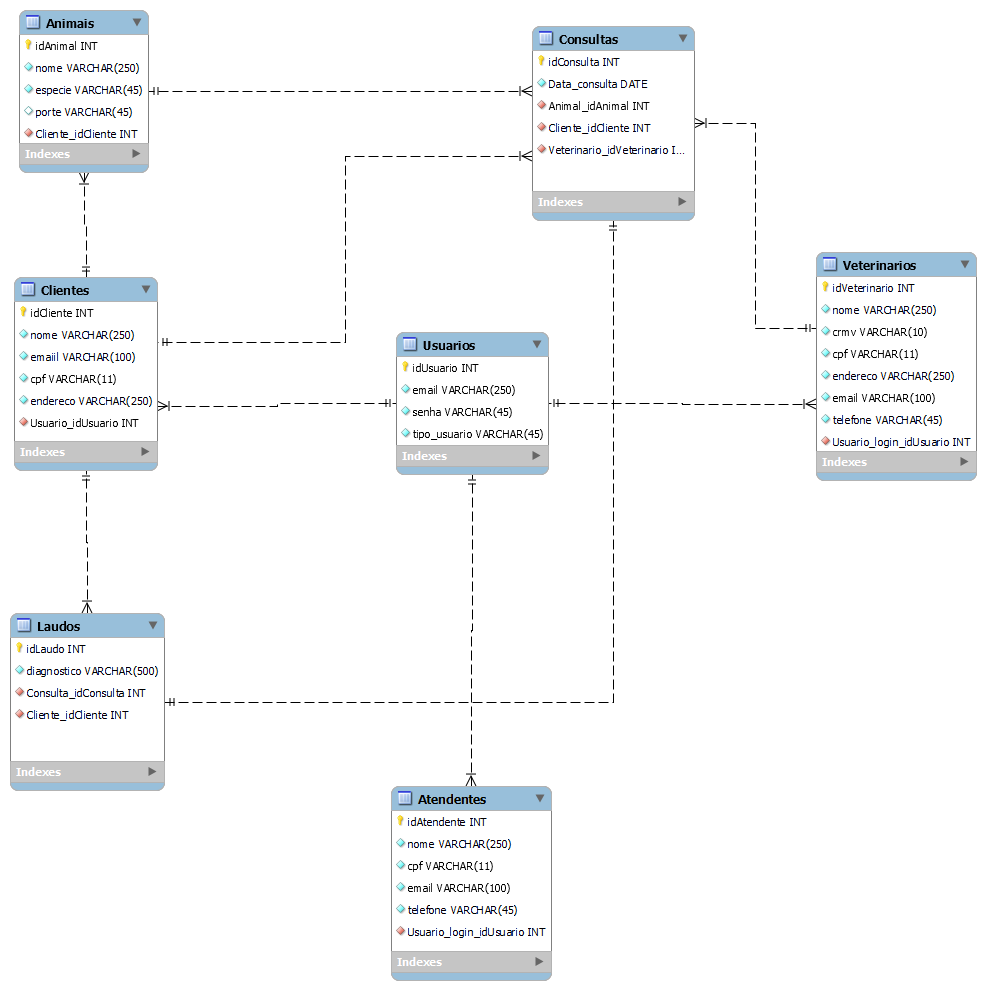
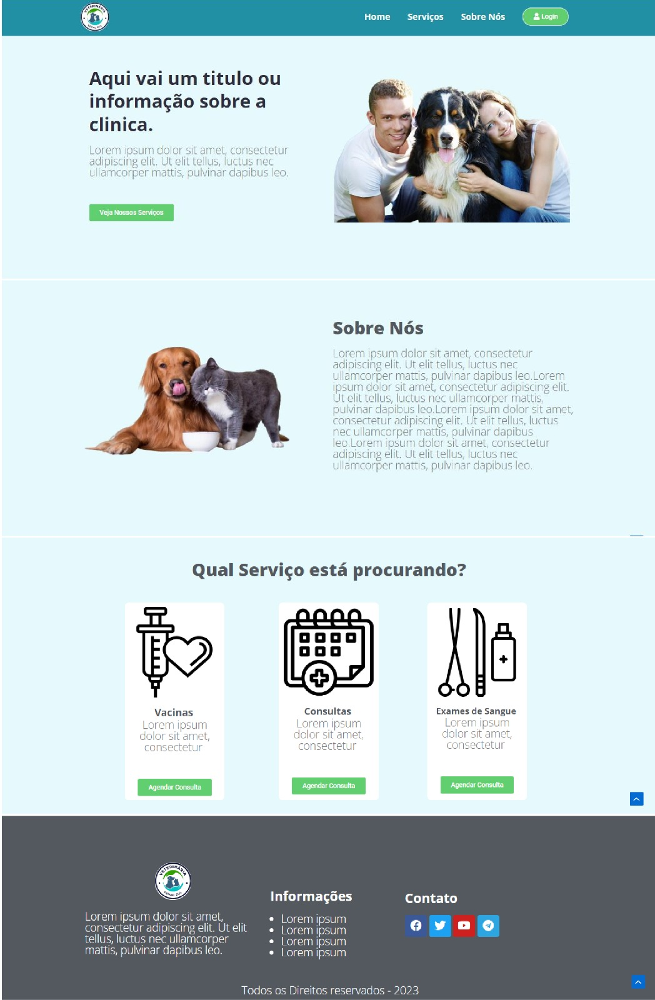
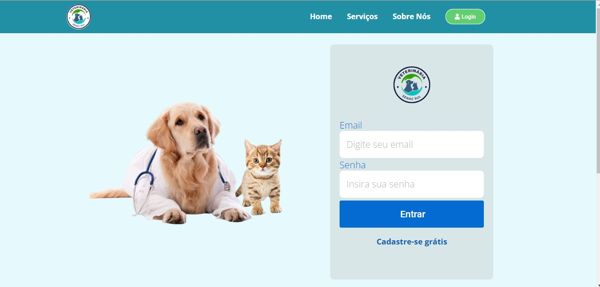
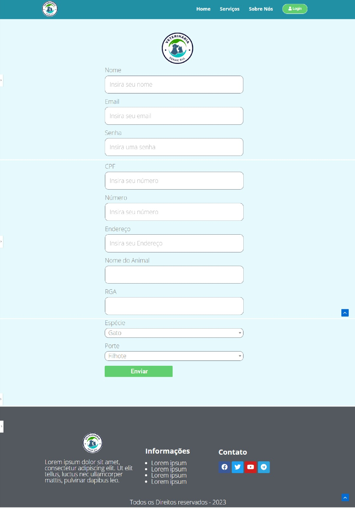
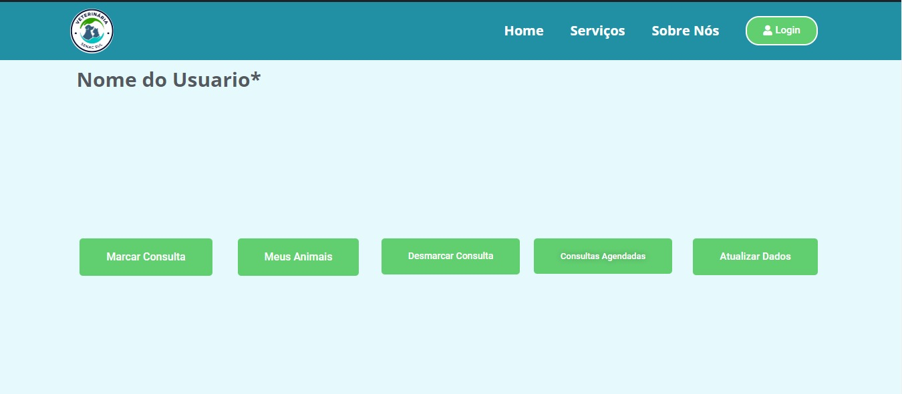

# Clínica Veterinária 

## Autores

- [@LaurianoCarlos](https://www.github.com/LaurianoCarlos)
- [@AnaLuciaBoehme](https://www.github.com/AnaLuciaBoehme)
- [@BrunoOliveira](https://www.github.com/LowNur)

## Norma de Requisitos - Sistema de Gerenciamento de Clínica Veterinária

### Funcionalidades:
- **Cadastro de Clientes:** O sistema deve permitir que os funcionários da clínica veterinária cadastrem informações detalhadas dos clientes, incluindo nome, informações de contato.
- **Atualização de Dados:** Os funcionários autorizados devem poder atualizar as informações cadastrais dos clientes e dos animais de estimação quando necessário, garantindo dados precisos e atualizados.
- **Agendamento de Consultas Veterinárias:** O sistema deve oferecer a funcionalidade de agendar consultas veterinárias para os animais de estimação dos clientes, permitindo a escolha de datas e horários disponíveis.
- **Gerenciamento de Consultas Veterinárias:** Os funcionários devem ter a capacidade de marcar, remarcar ou desmarcar consultas veterinárias conforme necessário, com a devida atualização do calendário da clínica.
- **Envio de Relatórios Médicos Veterinários:** Os veterinários devem poder gerar relatórios médicos detalhados para os animais de estimação dos clientes, garantindo a segurança e a confidencialidade dos dados.

### Funcionalidades dos usuários: 
- **Auto Cadastro de Clientes:** Os clientes devem ter a capacidade de se cadastrar no sistema, preenchendo informações básicas, que serão posteriormente revisadas e validadas pelos funcionários da clínica veterinária.

- **Verificação/Atualização de Dados Cadastrais:** Os clientes e funcionários autorizados devem poder verificar e atualizar os dados cadastrais dos clientes e dos animais de estimação, garantindo que as informações estejam corretas e atualizadas.

- **Agendamento de Consultas Veterinárias:** Os clientes devem poder agendar consultas veterinárias por meio do sistema, escolhendo datas e horários disponíveis de acordo com a disponibilidade da clínica veterinária.

- **Desmarcação de Consultas Veterinárias:** Os clientes e funcionários devem ter a capacidade de desmarcar consultas veterinárias agendadas, liberando horários para outros clientes e atualizando o calendário da clínica veterinária.

## Caso de Uso

## Diagrama Entidade-Relacionamento (MER) – modelagem conceitual

## Diagrama Entidade-Relacionamento (MER) – modelagem lógico

# Guia de Uso: Caminho do Usuário

Este guia descreve o fluxo do usuário em nossa aplicação, desde a área não logada até a área de usuário logado.

## Área Não Logada

### 1. Tela de Início

- Ao acessar a aplicação pela primeira vez, você será direcionado para a tela de início.
- Aqui, você pode explorar informações sobre o nosso serviço, produtos ou qualquer outra informação relevante que fornecemos aos visitantes não logados.

### 2. Tela de Login

- Para acessar recursos exclusivos e personalizados, você precisará fazer login.
- Insira seu e-mail e senha.
- Clique em "Entrar" para acessar sua conta.

### 3. Cadastro de Usuário

- Se você ainda não tem uma conta, pode criar uma facilmente.
- Na tela de login, clique em "Cadastre-se Grátis".
- Preencha o formulário de registro com suas informações pessoais, como nome, e-mail, senha e outras informações.
- Clique em "Enviar" para criar sua conta.

## Usuário Logado

### 4. Área de Usuário Logado

- Após fazer login com sucesso, você será direcionado para a sua área pessoal.
- Aqui, você pode acessar recursos exclusivos, configurar suas informações, realizar ações específicas.
- Navegue pelo menu ou use os atalhos na tela para explorar as opções disponíveis.
